# PyCraft - Ursina Engine ile Minecraft Klonu

Bu proje, Python'un Ursina Engine kütüphanesi kullanılarak geliştirilmiş, gelişmiş mekaniklere, optimizasyonlara ve modern UI elementlerine sahip kapsamlı bir Minecraft klonudur.

> **🎮 Input Sistemi Güncellemesi**: Oyun kontrolleri tamamen yeniden organize edildi ve kategorilere ayrıldı. Detaylı açıklamalar için [Input Sistemi Detaylı Açıklama](#-input-sistemi-detaylı-açıklama) bölümüne bakın.

## 🚀 Öne Çıkan Özellikler

- **Gelişmiş Optimizasyon**: Chunk sistemi ve Thread tabanlı mesh üretimi ile yüksek FPS performansı.
- **Dinamik Görüş (Culling)**: Oyuncunun görüş açısı dışındaki ve uzaktaki chunkların otomatik gizlenmesi.
- **Gelişmiş Performans Monitörü (F3)**: FPS, koordinatlar, chunk bilgisi, varlık sayısı ve bellek kullanımını gösteren kapsamlı panel ("Motor Analizi"). `Shift+F3` ile detaylı metrikler ve `Alt+F3` ile benchmark modu. Tamamen Türkçe yerelleştirme, Minecraftia font desteği ve **Minimalist modern tasarım**.
- **Gelişmiş Karakter Sistemi (Alex & Steve)**: `Mouse 4` tuşu ile Steve ve Alex modelleri arasında anlık geçiş. Her karakter için özel avatar, renk teması ve ilerleme çubuklu "Premium UI V3" bildirim sistemi.
- **Büyülü Dönüşüm Efektleri (VFX & SFX)**: Karakter değiştirirken oluşan yıldız parçacık patlamaları, "Pop" büyüme animasyonu ve büyüleyici ses efektleri.
- **Chunk Hata Ayıklayıcı (F4)**: Dünyayı teknik olarak incelemek için 4 farklı mod (Tel Kafes, Izgara, Vurgulama, Yükleme Bölgesi).
- **Can ve Açlık Sistemi**: Gerçekçi hayatta kalma mekanikleri. Aç kaldıkça can azalması, tokken can yenilenme.
- **Düşme Hasarı & Spawn Koruması**: Yükseklikten düşüşlerde hasar alma ve yeniden canlanma sonrası 3 saniyelik geçici koruma kalkanı.
- **Gelişmiş Hayvan Yapay Zekası & Sesler**: Hayvanlar için korkma, takip etme, üreme, büyüme ve birbirini itme mekanikleri. Her hayvan türü için (İnek, Koyun, Domuz) özgün ve atmosferik ses efektleri.
- **Steve & Alex Sistemi (3. Şahıs)**: Gelişmiş karakter modelleri; hasar alma (kırmızı parlama), yemek yeme ve ölüm animasyonları. Hareketli pelerin ve dinamik gölge (Blob Shadow) desteği. Karakter tipine göre kol kalınlığı (Steve: Kalın, Alex: İnce) değişimi.
- **Dinamik Nişangah (Crosshair)**: Ekranda hassas etkileşim için merkezi crosshair desteği. Bakılan bloğa göre renk ve büyüklük değişimi.
- **Eşya İsim Göstergesi**: Hotbar'da eşya değiştirildiğinde ekranda beliren şık eşya ismi ve adet bilgisi.
- **Kademeli Blok Kırma**: Bloklar kırılırken ilerleme oranına göre 10 farklı aşamada çatlayan (Progressive Cracking) gerçekçi efekt.
- **Zincirleme Odun Kırma (Timber)**: `Left Shift` basılı tutularak bir kütük kırıldığında, bağlı tüm kütüklerin zincirleme bir şekilde (animasyonlu) kırılması.
- **Yaprak Dökülmesi (Leaf Decay)**: Ağaç kütüğü kesildiğinde desteklenmeyen yaprakların süzülerek dökülmesi ve elma/çubuk düşürme mekaniği.
- **Ses Sürükleyiciliği**: Adım seslerinin yürünen zemine (çimen, taş, ahşap) göre dinamik olarak değişmesi.
- **Gelişmiş Envanter & Sürükle-Bırak**: 36 slotluk dinamik envanter. Eşyaları sürükleyebilir, adetleri paylaştırabilir veya dünyaya fırlatabilirsiniz.
- **Üretim (Crafting)**: Hem envanter içi 2x2, hem de Çalışma Masası (Crafting Table) ile gelişmiş üretim menüsü (Reçete kitabı desteği ile).
- **Madenler & Aletler**: Kömür, Demir ve Elmas cevherleri. Ahşap, Taş, Demir ve Elmas alet setleri ile hiyerarşik toplama sistemi (Doğru aletle 3 kat hızlı kazım).
- **Gelişmiş Gece-Gündüz Döngüsü**: Dinamik ışıklandırma, güneş/ay pozisyonları, yıldızlar ve atmosferik efektlerle 24 saatlik döngü.
- **Hava Durumu Sistemi**: Yağmur, fırtına, gök gürültüsü ve yere düşen damla (splash) efektleriyle gerçekçi hava koşulları.
- **Dinamik Gökyüzü**: Güneş, ay (fazlarıyla), yıldızlar ve bulutlarla zamanla değişen gökyüzü sistemi.

## 🛠️ Kontroller

PyCraft'ta tüm kontroller kategorilere ayrılmış ve optimize edilmiştir. Aşağıda her kategorinin detaylı açıklaması bulunmaktadır.

### 🎮 Temel Hareket Kontrolleri

| Tuş                | Fonksiyon      | Açıklama                                           |
| ------------------ | -------------- | -------------------------------------------------- |
| **W, A, S, D**     | Hareket        | İleri, sola, geri, sağa hareket                    |
| **Boşluk (Space)** | Zıplama        | Yukarı zıpla (çift zıplama yok)                    |
| **Left Shift**     | Eğilme (Sneak) | Yavaş hareket, blok kenarlarından düşmeyi engeller |
| **Left Ctrl**      | Koşma (Sprint) | W ile birlikte hızlı koşu (açlık tüketir)          |
| **Fare Hareketi**  | Kamera         | Etrafınıza bakın                                   |

### 🔨 Etkileşim Kontrolleri

| Tuş                | Fonksiyon                    | Açıklama                                                         |
| ------------------ | ---------------------------- | ---------------------------------------------------------------- |
| **Sol Tık**        | Blok Kırma / Saldırı         | Bloğa veya varlığa sol tıklayarak kır/vur                        |
| **Sağ Tık**        | Blok Yerleştirme / Etkileşim | Blok yerleştir veya çalışma masası gibi objelerle etkileşime geç |
| **Fare Tekerleği** | Hotbar Geçişi                | Hızlı slot değiştirme (yukarı/aşağı)                             |
| **1-9**            | Hotbar Slot Seçimi           | Doğrudan slot seçimi                                             |

### 🎒 Envanter ve Eşya Yönetimi

| Tuş                         | Fonksiyon             | Açıklama                                            |
| --------------------------- | --------------------- | --------------------------------------------------- |
| **E**                       | Envanter Aç/Kapat     | 36 slotluk envanteri açar/kapatır                   |
| **F**                       | Yemek Ye              | Eldeki yemek eşyasını tüket (açlık barını doldurur) |
| **Q**                       | Eşya At (1 Adet)      | Eldeki eşyadan 1 adet dünyaya fırlat                |
| **Ctrl + Q**                | Stack At (Tümü)       | Eldeki eşyanın tamamını dünyaya fırlat              |
| **Shift + Q**               | Stack At (Alternatif) | Eldeki eşyanın tamamını dünyaya fırlat              |
| **Left Shift (Envanterde)** | Hızlı Taşıma          | Eşyaları envanter ve hotbar arasında hızlıca taşı   |

### 📷 Kamera ve Karakter Kontrolleri

| Tuş         | Fonksiyon            | Açıklama                                             |
| ----------- | -------------------- | ---------------------------------------------------- |
| **Mouse 5** | Kamera Modu          | 1. Şahıs → 3. Şahıs Arka → 3. Şahıs Ön (döngüsel)    |
| **Mouse 4** | Karakter Değiştir    | Steve ↔ Alex (büyülü dönüşüm efektleri ile)          |
| **C**       | Zoom (Yakınlaştırma) | Basılı tutarak yakınlaştır (fare hassasiyeti azalır) |

### 🖼️ Sistem Kontrolleri

| Tuş     | Fonksiyon                     | Açıklama                                               |
| ------- | ----------------------------- | ------------------------------------------------------ |
| **F2**  | Ekran Görüntüsü               | Ekran görüntüsü al (screenshots/ klasörüne kaydedilir) |
| **Esc** | Menü Kapat / Kursör Kilidi Aç | Açık menüleri kapat veya fare kilidini aç              |

### 🐛 Debug ve Performans Araçları

| Tuş            | Fonksiyon                           | Açıklama                                           |
| -------------- | ----------------------------------- | -------------------------------------------------- |
| **F3**         | Motor Analizi (Performans Monitörü) | FPS, koordinat, chunk ve bellek bilgilerini göster |
| **Shift + F3** | Detaylı Metrikler                   | Genişletilmiş performans istatistikleri            |
| **Ctrl + F3**  | Metrikleri Sıfırla                  | Performans verilerini sıfırla                      |
| **Alt + F3**   | Benchmark Modu                      | 30 saniyelik performans testi başlat               |
| **F4**         | Chunk Debugger                      | Chunk görselleştirme ve analiz aracı               |

#### Chunk Debugger Alt Kontrolleri (F4 Açıkken)

| Tuş        | Fonksiyon             | Açıklama                                    |
| ---------- | --------------------- | ------------------------------------------- |
| **1**      | Wireframe Modu        | Chunk sınırlarını tel kafes olarak göster   |
| **2**      | Grid Modu             | Chunk ızgarasını göster                     |
| **3**      | Highlight Modu        | Aktif chunk'ları vurgula                    |
| **4**      | Load Zone Modu        | Yükleme bölgelerini göster                  |
| **+**      | Görüş Mesafesi Artır  | Chunk görüntüleme mesafesini artır (max 10) |
| **-**      | Görüş Mesafesi Azalt  | Chunk görüntüleme mesafesini azalt (min 1)  |
| **I**      | Bilgi Paneli          | Chunk bilgi panelini aç/kapat               |
| **Delete** | Chunk Boşalt          | Bakılan chunk'ı hafızadan boşalt            |
| **Home**   | Tüm Chunk'ları Yenile | Tüm chunk'ları yeniden yükle                |

### ⏰ Zaman ve Gün/Gece Döngüsü Kontrolleri

| Tuş           | Fonksiyon              | Açıklama                                  |
| ------------- | ---------------------- | ----------------------------------------- |
| **T**         | Mevcut Zamanı Göster   | Konsola oyun içi saati yazdır             |
| **F6**        | Saat Geri Al (-1 Saat) | Zamanı 1 saat geriye al                   |
| **F7**        | Hız x2                 | Zaman akışını 2 kat hızlandır             |
| **F8**        | Hız x10                | Zaman akışını 10 kat hızlandır            |
| **F9**        | Duraklat/Devam         | Zamanı duraklat veya devam ettir          |
| **F10**       | Normal Hız             | Zaman akışını normale döndür (x1)         |
| **F11**       | Gece (22:00)           | Doğrudan geceye atla (karanlık test için) |
| **F12**       | Sabah (06:00)          | Doğrudan sabaha atla                      |
| **Page Up**   | Hızlı İleri Sar        | Basılı tutarak zamanı hızlıca ilerlet     |
| **Page Down** | Hızlı Geri Sar         | Basılı tutarak zamanı hızlıca geri al     |

### 🌧️ Hava Durumu ve Yağmur Kontrolleri

| Tuş   | Fonksiyon            | Açıklama                                                  |
| ----- | -------------------- | --------------------------------------------------------- |
| **R** | Yağmur Aç/Kapat      | Yağmuru manuel olarak başlat/durdur                       |
| **N** | Hava Durumu Değiştir | Açık → Bulutlu → Kapalı → Yağmurlu → Fırtınalı (döngüsel) |
| **V** | Hava Durumu Bilgisi  | Detaylı yağmur ve hava durumu bilgilerini konsola yazdır  |

### 🧪 Test ve Geliştirici Araçları

| Tuş   | Fonksiyon      | Açıklama                                                          |
| ----- | -------------- | ----------------------------------------------------------------- |
| **U** | Test Parçacığı | Oyuncunun önünde test parçacığı oluştur (5 saniye sonra kaybolur) |

### 💡 Özel Mekanikler

| Mekanik                            | Açıklama                                                                    |
| ---------------------------------- | --------------------------------------------------------------------------- |
| **Zincirleme Odun Kırma (Timber)** | Left Shift basılı tutarak kütük kır → Bağlı tüm kütükler zincirleme kırılır |
| **Yaprak Dökülmesi**               | Ağaç kütüğü kesilince desteklenmeyen yapraklar süzülerek dökülür            |
| **Kademeli Blok Kırma**            | Bloklar kırılırken 10 aşamalı çatlama animasyonu gösterir                   |
| **Düşme Hasarı**                   | 5 bloktan yüksekten düşünce hasar al                                        |
| **Spawn Koruması**                 | Yeniden canlanma sonrası 3 saniye geçici koruma kalkanı                     |

### 🎯 İpuçları

- **Koşma (Sprint)**: Açlık tüketir, dikkatli kullanın
- **Eğilme (Sneak)**: Blok kenarlarından düşmeyi engeller, yaprak kırarken yaprakları pas geçer
- **Zoom (C)**: Uzak nesneleri incelemek için kullanın, fare hassasiyeti otomatik azalır
- **Envanter Yönetimi**: Shift ile hızlı taşıma, Ctrl+Q ile stack atma
- **Karakter Değişimi**: Mouse 4 ile Steve ve Alex arasında geçiş yapın, her karakterin kendine özgü kol kalınlığı var
- **Debug Araçları**: F3 ve F4 ile oyunun teknik detaylarını inceleyin
- **Zaman Kontrolü**: F6-F12 tuşları ile zamanı istediğiniz gibi yönetin (test için ideal)

---

## 🛠️ Kontroller (Eski Versiyon - Referans)

- **W, A, S, D**: Hareket

---

## 📦 Proje Yapısı

Asetler (assets) klasörünün tam içeriği aşağıda listelenmiştir:

### 🔊 Sesler (`assets/sounds`)

| Önizleme | Dosya Adı     | Açıklama              |
| :------: | :------------ | :-------------------- |
|    🔊    | `break.wav`   | Blok kırma sesi       |
|    🔊    | `damage.wav`  | Hasar alma sesi       |
|    🔊    | `place.wav`   | Blok yerleştirme sesi |
|    🔊    | `punch.wav`   | Vuruş/Yumruk sesi     |
|    🔊    | `step.wav`    | Yürüme/Adım sesi      |
|    🔊    | `rain.wav`    | Yağmur sesi           |
|    🔊    | `splash.wav`  | Su sıçrama sesi       |
|    🔊    | `thunder.wav` | Gök gürültüsü sesi    |
|    🔊    | `swing.wav`   | Kol/Alet sallama sesi |
|    🔊    | `eat.wav`     | Yemek yeme sesi       |
|    🔊    | `cow1.wav`    | İnek sesleri          |
|    🔊    | `pig1.wav`    | Domuz sesleri         |
|    🔊    | `sheep1.wav`  | Koyun sesleri         |

### 🧱 Bloklar (`assets/textures/blocks`)

|                                Önizleme                                | Dosya Adı                  | Açıklama                      |
| :--------------------------------------------------------------------: | :------------------------- | :---------------------------- |
|        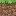         | `grass.png`                | Çimen bloğu (Yan yüz)         |
|             | `grass_top.png`            | Çimen bloğu (Üst yüz)         |
|                 | `stone.png`                | Taş bloğu                     |
|                  | `dirt.png`                 | Toprak bloğu                  |
|                  | `wood.png`                 | İşlenmiş tahta bloğu          |
|         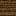          | `log.png`                  | Odun/Kütük bloğu (Yan yüz)    |
|               | `log_top.png`              | Odun/Kütük bloğu (Üst yüz)    |
|                | `leaves.png`               | Yaprak bloğu                  |
|       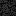        | `bedrock.png`              | Katman kayası                 |
|              | `coal_ore.png`             | Kömür cevheri                 |
|              | `iron_ore.png`             | Demir cevheri                 |
|           | `diamond_ore.png`          | Elmas cevheri                 |
|    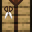    | `crafting_table.png`       | Çalışma masası (Yan yüz)      |
|    | `crafting_table_top.png`   | Çalışma masası (Üst yüz)      |
| 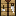 | `crafting_table_front.png` | Çalışma masası (Ön yüz)       |
|                  | `wool.png`                 | Yün bloğu                     |
|        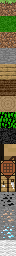         | `atlas.png`                | Dokuların birleştirilmiş hali |

#### � Kırılma Efektleri (`assets/textures/blocks/break`)

|                            Önizleme                             | Dosya Adı     | Aşama    |
| :-------------------------------------------------------------: | :------------ | :------- |
|  | `break_0.png` | Aşama 1  |
|  | `break_1.png` | Aşama 2  |
|  | `break_2.png` | Aşama 3  |
|  | `break_3.png` | Aşama 4  |
|  | `break_4.png` | Aşama 5  |
|  | `break_5.png` | Aşama 6  |
|  | `break_6.png` | Aşama 7  |
|  | `break_7.png` | Aşama 8  |
|  | `break_8.png` | Aşama 9  |
|  | `break_9.png` | Aşama 10 |

### 🗡️ Eşyalar (`assets/textures/items`)

|                             Önizleme                             | Dosya Adı             | Açıklama    |
| :--------------------------------------------------------------: | :-------------------- | :---------- |
|   | `wooden_pickaxe.png`  | Ahşap kazma |
|  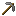  | `stone_pickaxe.png`   | Taş kazma   |
|  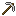   | `iron_pickaxe.png`    | Demir kazma |
| 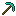 | `diamond_pickaxe.png` | Elmas kazma |
|   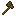    | `wooden_axe.png`      | Ahşap balta |
|    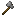    | `stone_axe.png`       | Taş balta   |
|    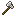     | `iron_axe.png`        | Demir balta |
|   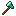   | `diamond_axe.png`     | Elmas balta |
|  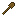  | `wooden_shovel.png`   | Ahşap kürek |
|     | `stone_shovel.png`    | Taş kürek   |
|   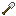   | `iron_shovel.png`     | Demir kürek |
|   | `diamond_shovel.png`  | Elmas kürek |
|  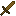   | `wooden_sword.png`    | Ahşap kılıç |
|      | `stone_sword.png`     | Taş kılıç   |
|       | `iron_sword.png`      | Demir kılıç |
|    | `diamond_sword.png`   | Elmas kılıç |
|            | `stick.png`           | Çubuk       |
|            | `apple.png`           | Elma        |
|      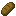      | `bread.png`           | Ekmek       |
|   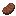   | `cooked_meat.png`     | Pişmiş et   |
|             | `coal.png`            | Kömür       |
|       | `iron_ingot.png`      | Demir külçe |
|          | `diamond.png`         | Elmas       |
|      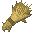      | `wheat.png`           | Buğday      |
|             | `wool.png`            | Yün         |
|     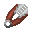      | `shears.png`          | Makas       |

### 🖥️ Arayüz (`assets/textures/ui`)

|                           Önizleme                            | Dosya Adı             | Açıklama          |
| :-----------------------------------------------------------: | :-------------------- | :---------------- |
|        | `crosshair.png`       | Nişangah          |
|       | `heart_icon.png`      | Dolu kalp ikon    |
|      | `heart_empty.png`     | Boş kalp ikon     |
|      | `hunger_icon.png`     | Dolu açlık ikon   |
|     | `hunger_empty.png`    | Boş açlık ikon    |
|      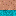       | `hand.png`            | Oyuncu eli        |
|  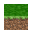  | `grass_icon_3d.png`   | 3B Çimen ikonu    |
|  | `damage_vignette.png` | Hasar alma efekti |
|            | `cloud.png`           | Bulut dokusu      |
|             | `moon.png`            | Ay dokusu         |
|             | `star.png`            | Yıldız dokusu     |
|              | `sun.png`             | Güneş dokusu      |
|        | `night_sky.png`       | Gece gökyüzü      |

### 🐄 Varlıklar (`assets/textures/entities`)

|                         Önizleme                          | Dosya Adı   | Açıklama     |
| :-------------------------------------------------------: | :---------- | :----------- |
|  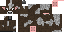  | `cow.png`   | İnek dokusu  |
|  | `sheep.png` | Koyun dokusu |
|  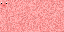  | `pig.png`   | Domuz dokusu |

### 👤 Oyuncu Görünümleri (`assets/skins`)

|                   Önizleme                    | Dosya Adı   | Açıklama       |
| :-------------------------------------------: | :---------- | :------------- |
|  | `steve.png` | Steve görünümü |
|   | `alex.png`  | Alex görünümü  |

## ⚙️ Kurulum ve Çalıştırma

### Hızlı Başlangıç

1. **Tek Satırda Kurulum ve Çalıştırma:**

```bash
pip install -r requirements.txt && python texture_gen.py && python main.py
```

### Manuel Kurulum

2. **Adım Adım Kurulum:**
   - Gerekli kütüphaneleri yükleyin:

     ```bash
     pip install -r requirements.txt
     ```

   - Dokuları oluşturun:

     ```bash
     python texture_gen.py
     ```

   - Oyunu başlatın:
     ```bash
     python main.py
     ```

### Windows Kullanıcıları İçin

3. **Batch Dosyaları ile Kolay Çalıştırma:**
   - **Basit çalıştırma**: `run_game.bat` dosyasına çift tıklayın
   - **UTF-8 desteği ile**: `run_game_utf8.bat` dosyasını kullanın (Türkçe karakter sorunları için)
   - **Hata ayıklama**: `run_game_fixed.py` ile encoding sorunlarını çözün

### GitHub Güncelleme

4. **Proje Güncelleme:**
   - `update_github.bat` ile projeyi otomatik olarak GitHub'a yükleyin
   - Akıllı commit mesajları ve çakışma kontrolü

## ⚒️ Üretim Tarifleri (Crafting)

Oyun içerisinde **Çalışma Masası (Crafting Table)** kullanarak aşağıdaki temel eşyaları üretebilirsiniz:

| Sonuç           | Malzemeler          | Desen (3x3)         |
| :-------------- | :------------------ | :------------------ |
| **Ahşap Kazma** | 3 Tahta + 2 Çubuk   | `TTT`, `_Ç_`, `_Ç_` |
| **Taş Kazma**   | 3 Taş + 2 Çubuk     | `SSS`, `_Ç_`, `_Ç_` |
| **Demir Kazma** | 3 Demir + 2 Çubuk   | `DDD`, `_Ç_`, `_Ç_` |
| **Elmas Kazma** | 3 Elmas + 2 Çubuk   | `EEE`, `_Ç_`, `_Ç_` |
| **Kılıç**       | 2 Malzeme + 1 Çubuk | `_M_`, `_M_`, `_Ç_` |
| **Balta**       | 3 Malzeme + 2 Çubuk | `MM_`, `MÇ_`, `_Ç_` |
| **Kürek**       | 1 Malzeme + 2 Çubuk | `_M_`, `_Ç_`, `_Ç_` |
| **Çubuk**       | 2 Tahta             | `_T_`, `_T_`, `___` |

## 🎮 Gelişmiş Özellikler

### Dinamik Kamera Sistemi

- **View Bobbing**: Yürürken gerçekçi kamera sallanması
- **FOV Değişimi**: Koşarken genişleyen, eğilirken daralan görüş açısı
- **Zoom Fonksiyonu**: C tuşu ile yakınlaştırma (Zoom sırasında fare hassasiyeti otomatik düşer)
- **Kamera Shake**: Hasar alındığında titreme efekti

### Gelişmiş Hareket Sistemi

- **Sneak (Eğilme)**: Left Shift ile yavaş ve sessiz hareket
- **Sprint (Koşma)**: Left Ctrl + W ile hızlı koşu
- **Dinamik Hız**: Hareket türüne göre değişen oyuncu hızı
- **Yükseklik Ayarı**: Eğilirken karakter boyunun kısalması

### El ve Alet Animasyonları

- **Türe Özgü Animasyonlar**: Her alet için özel sallama animasyonu
- **Kazma**: Dikey, sert vuruş hareketi
- **Balta**: Geniş, yana açılan vuruş
- **Kürek**: Saplama ve kaldırma hareketi
- **Kılıç**: Yatay savurma hareketi
- **3D Blok Görünümü**: Eldeki bloklar 3 boyutlu olarak görünür
- **Dinamik Gölge**: Oyuncunun altında zemine uyumlu "Blob Shadow" gölge sistemi
- **Steve & Alex Animasyonları**: Damage (hasar), Eat (yemek) ve Death (ölüm) için özel modeller arası animasyon tetikleri.
- **Premium Bildirim Sistemi (V3)**: Karakter değişimi ve ekran görüntüsü alımı gibi olaylar için sağ üstte beliren, animasyonlu, karakter avatarlı ve progress bar destekli bildirimler.
- **Dönüşüm VFX**: Karakter değiştirirken Steve (Azure) veya Alex (Turuncu) temalı yıldız parçacık patlamaları ve "Pop" büyüme animasyonu.

## 🧩 Mekanik Notları

Her blok türünün (taş, toprak, odun) kendine has bir direnci vardır. Doğru alet (Taş -> Kazma) kullanıldığında kırma hızı **3 kat** artar. Kırılamayan bloklar (Bedrock) için madencilik yapılamaz.

### Hayatta Kalma

Açlık barınız %80'in üzerindeyken canınız yavaşça yenilenir. Açlığınız tamamen biterse saniyede bir hasar almaya başlarsınız. 5 bloktan daha yüksekten düştüğünüzde (altın kural) düşme hasarı alırsınız.

### Hayvan Yapay Zekası & Üreme

Hayvanlar çevreleriyle etkileşime girer:

- **Korku**: Hasar aldıklarında oyuncudan uzağa kaçarlar.
- **Evcilleştirme/Takip**: Elinizde yemek (buğday, elma, ekmek) varken sizi takip ederler.
- **Üreme**: İki yetişkin hayvanı beslediğinizde aşk moduna girerler ve yeni bir yavru doğar.
- **Büyüme**: Yavru hayvanlar zamanla gelişerek yetişkin boyutuna ulaşır.
- **İtme**: Hayvanlar birbirlerinin içine girmez, gerçekçi fiziksel mesafelerini korurlar.

### Yaprak Dökülmesi (Leaf Decay)

Gerçekçi ağaç mekanikleri:

- **Otomatik Dökülme**: Bir ağacın kütüğünü tamamen kestiğinizde, ona bağlı olan yapraklar desteklerini kaybeder.
- **Zamanlı Kaybolma**: Desteklenmeyen yapraklar 2-5 saniye içinde süzülerek yok olur.
- **Ganimet**: Dökülen yapraklardan %10 şansla **Elma** veya %20 şansla **Çubuk** düşebilir.
- **Görsel Efektler**: Yapraklar dökülürken parçacık efektleri ve süzülme animasyonu sergiler.

### Gece-Gündüz Döngüsü

Oyun 24 saatlik dinamik bir zaman sistemine sahiptir:

- **Gündüz (06:00-18:00)**: Parlak ışıklandırma, açık mavi gökyüzü
- **Şafak (05:00-06:00)**: Turuncu geçiş renkleri
- **Alacakaranlık (18:00-19:00)**: Kırmızı geçiş renkleri
- **Gece (19:00-05:00)**: Karanlık ortam, ay ve yıldızlar görünür
- **Dinamik Işıklandırma**: Zamanla değişen ambient ve directional ışık
- **Atmosferik Efektler**: Sis rengi ve yoğunluğu zamanla değişir

### Hava Durumu Sistemi

Gerçekçi hava koşulları:

- **Yağmur Türleri**: Hafif, orta, şiddetli ve fırtınalı yağmur
- **Görsel Efektler**: 400'e kadar yağmur damlası parçacığı
- **Ses Efektleri**: Yağmur sesi, gök gürültüsü ve su sıçrama sesleri
- **Atmosferik Değişiklikler**: Yağmurda sis yoğunluğu artar
- **Splash Efektleri**: Yağmur damlaları yere çarptığında görsel ve ses efektleri

## �️ Yol Haritası

### 🌟 Yeni Ekleyeceğim Özellikler

- [ ] **Mimari Refactoring**: Monolitik yapıdan modüler sisteme geçiş (game/world.py, game/player.py vb.).
- [ ] **Sonsuz Dünya**: Mevcut sınırların ötesine uzanan dinamik dünya üretimi.
- [ ] **Kaydet/Yükle Sistemi**: Dünya durumunu ve envanteri dosya olarak kaydetme.
- [ ] **Biyom Sistemi**: Farklı iklimler, bitki örtüsü ve ağaç çeşitliliği.
- [x] **Tavuk Sistemi**: Gelişmiş tavuk yapay zekası - kanat çırpma ile düşme yavaşlatma, baş sallama animasyonu, rastgele zıplama, yumurta bırakma mekaniği (15-35 saniye), tohum yeme davranışı, bebek tavuk sistemi ve performans optimizasyonu. Yumurta fırlatma ile %12.5 şans tavuk spawn (nadiren 4 tavuk birden).
- [ ] **Canlı Ekoloji**: İnek ve Domuz için gelişmiş yapay zeka (Dolaşma, Kaçma, Takip Etme).
- [ ] **Dekorasyon Blokları**: Kapı, cam, meşale (fonksiyonel) ve mobilyalar.
- [ ] **Görsel Zenginlik (VFX)**: Shader desteği (su yansımaları, sallanan bitkiler) ve gelişmiş parçacık efektleri.
- [x] **Ses Sürükleyiciliği**: Adım seslerinin yürünen blok türüne (taş vs toprak) göre değişmesi (Düzeltildi).
- [ ] **Gelişmiş Aydınlatma**: Blok bazlı ışık yayılımı (Light propagation).

### 🐞 Düzelteceğim Hatalar

- [ ] **Saydamlık Sıralaması**: Su ve yaprakların arkasındaki objelerin bazen görünmemesi (Alpha Sorting).
- [ ] **Fiziksel Çakışmalar**: Yüksek hızda koşarken nadiren blokların içinden geçme hatası.
- [ ] **UI Ölçeklendirme**: Farklı ekran çözünürlüklerinde bazı metinlerin kayması.
- [ ] **Gölge Titremesi**: Karakter gölgesinin (Blob Shadow) engebeli arazilerde titremesi.
- [x] **PSUtil Entegrasyonu**: Bellek kullanımının 0.0 MB görünme hatası (Düzeltildi).
- [x] **Karakter Değişim Çökmesi**: Karakter değiştirirken oluşan animasyon referans hatası (Düzeltildi).

## �📄 Lisans

Bu proje **MIT Lisansı** altında lisanslanmıştır. Daha fazla bilgi için [LICENSE](LICENSE) dosyasına göz atabilirsiniz.

## 🔧 Teknik Detaylar

### Performans Optimizasyonları

- **Chunk Sistemi**: Dünya 16x16 blok parçalarına bölünmüş
- **Thread-based Mesh Generation**: Arka planda mesh oluşturma
- **Frustum Culling**: Görüş alanı dışındaki chunkları gizleme
- **Texture Atlas**: Tüm blok dokularını tek dosyada birleştirme
- **Sound Caching**: Ses dosyalarını bellekte önbellekleme

### Grafik Sistemleri

- **Progressive Block Breaking**: 10 aşamalı blok kırma animasyonu
- **Dynamic Lighting**: Zamanla değişen ışık sistemi
- **Particle Systems**: Yağmur, splash ve kırma efektleri
- **UI Overlays**: Can, açlık, Türkçe yerelleştirilmiş debug ("Motor Analizi") ve "Motor Analizi" grafikleri.
- **Vignette Effects**: Hasar alma sırasında ekran efektleri
- **Custom Typography**: Tüm teknik ekranlarda ve bildirimlerde "Minecraftia" font kullanımı.

### Ses Sistemi

- **Spatial Audio**: 3D pozisyonel ses efektleri
- **Dynamic Pitch**: Blok kırma ve adım seslerinde rastgele perde değişimleri
- **Volume Control**: Mesafe ve çevre bazlı ses seviyesi
- **Ambient Sounds**: Yağmur, gök gürültüsü ve rüzgar efektleri
- **Interactive UI Sounds**: Envanter etkileşimleri ve tıklama sesleri

Bu proje eğitim ve hobi amaçlı geliştirilmiştir. Serbestçe modifiye edilebilir.

---

## 🎮 Input Sistemi Detaylı Açıklama

PyCraft'ın input sistemi, oyun deneyimini optimize etmek için kategorilere ayrılmış ve modüler bir yapıda tasarlanmıştır.

### 📋 Sistem Mimarisi

Input sistemi `main.py` dosyasında merkezi bir `input(key)` fonksiyonu ile yönetilir. Bu fonksiyon şu kategorilere ayrılmıştır:

#### 1. **Kamera ve Karakter Kontrolleri**

- **Mouse 5**: Kamera görünüm modları arasında geçiş yapar
  - Mod 0: Birinci Şahıs (FPS) - El ve crosshair görünür
  - Mod 1: Üçüncü Şahıs Arka - Karakteri arkadan gösterir
  - Mod 2: Üçüncü Şahıs Ön - Karakteri önden gösterir
  - Geçişler yumuşak animasyonlarla gerçekleşir (0.2 saniye, out_sine curve)

- **Mouse 4**: Karakter değiştirme sistemi
  - Steve ↔ Alex geçişi
  - VFX: 25 adet yıldız parçacık patlaması (karakter temasına göre renkli)
  - SFX: Blok yerleştirme sesi (0.8 volume)
  - Pop animasyonu: 0.8 → 1.0 scale (0.3 saniye, out_back curve)
  - Premium UI bildirimi: Avatar, başlık, açıklama ve progress bar ile

#### 2. **Sistem Kontrolleri**

- **F2**: Ekran görüntüsü alma
  - Dosya formatı: `screenshots/YYYY-MM-DD_HH-MM-SS.png`
  - Otomatik klasör oluşturma
  - Premium bildirim UI (3 saniye görünür)
  - Animasyonlu giriş/çıkış efektleri

#### 3. **Debug ve Performans Araçları**

- **F3**: Performans monitörü (Motor Analizi)
  - Temel mod: FPS, koordinat, chunk bilgisi
  - **Shift + F3**: Detaylı metrikler (min/max/avg FPS, bellek kullanımı)
  - **Ctrl + F3**: Metrikleri sıfırla
  - **Alt + F3**: 30 saniyelik benchmark testi
  - Hitbox görselleştirme (hayvanlar ve düşen eşyalar için)

- **F4**: Chunk Debugger
  - 4 farklı görselleştirme modu
  - Chunk bilgi paneli
  - Görüş mesafesi ayarlama (+/- tuşları)
  - Chunk yönetimi (Delete: boşalt, Home: yeniden yükle)

#### 4. **Zaman ve Gün/Gece Döngüsü**

- **F6-F12**: Zaman kontrolü
  - F6: 1 saat geri
  - F7: Hız x2
  - F8: Hız x10
  - F9: Duraklat/Devam
  - F10: Normal hız (x1)
  - F11: Gece (22:00)
  - F12: Sabah (06:00)
- **T**: Mevcut zamanı konsola yazdır
- **Page Up/Down**: Hızlı ileri/geri sarma (basılı tutma destekli)

#### 5. **Hava Durumu ve Yağmur Sistemi**

- **R**: Yağmur toggle (açık/kapalı)
  - Otomatik ses yönetimi (rain.wav loop)
  - Sis yoğunluğu ayarlama
  - Parçacık sistemi aktivasyonu

- **N**: Hava durumu döngüsü
  - Sıra: Clear → Cloudy → Overcast → Rainy → Stormy
  - Her hava durumunun kendine özgü yağmur türü ve şansı var
  - Türkçe isim desteği

- **V**: Detaylı hava durumu bilgisi
  - Yağmur durumu, türü, damla sayısı
  - Hız ve ses seviyesi bilgileri
  - Konsola formatlanmış çıktı

#### 6. **Oyun Mekanikleri**

- **E**: Envanter toggle
  - Crafting menüsü açıksa önce onu kapatır
  - 36 slotluk envanter sistemi
  - Sürükle-bırak desteği

- **F**: Yemek yeme
  - Sadece food tipindeki eşyalar için çalışır
  - Açlık barı kontrolü (dolu ise yemez)
  - 3. şahıs yeme animasyonu tetikleme
  - Yemek yeme sesi (eat.wav, 0.8 volume)

- **Q / Ctrl+Q / Shift+Q**: Eşya atma
  - Q: 1 adet at
  - Ctrl+Q veya Shift+Q: Tüm stack'i at

#### 7. **Test ve Geliştirici Araçları**

- **U**: Test parçacığı oluşturma
  - Oyuncunun önünde ve yukarısında (10 blok)
  - Kırmızı küp (2x2x2)
  - 5 saniye sonra otomatik yok olur
  - Debug ve test amaçlı

### 🔧 Teknik Detaylar

#### Global Değişkenler

```python
global camera_mode, current_character_type, player_model
```

- `camera_mode`: 0 (1. şahıs), 1 (3. şahıs arka), 2 (3. şahıs ön)
- `current_character_type`: 'steve' veya 'alex'
- `player_model`: Aktif karakter modeli referansı

#### Animasyon Sistemi

- **Curve Tipleri**:
  - `curve.out_sine`: Yumuşak kamera geçişleri
  - `curve.out_expo`: Parçacık patlamaları
  - `curve.out_back`: Pop/büyüme efektleri
  - `curve.in_quad`: Çıkış animasyonları
  - `curve.linear`: Progress bar'lar

#### Ses Yönetimi

- Tüm sesler `play_block_sound()` fonksiyonu ile çalınır
- Volume kontrolü (0.0 - 1.0)
- Yağmur sesi loop desteği
- Ses cache sistemi (performans için)

#### UI Bildirimleri

- **Premium Notification System V3**:
  - Avatar kutusu (karakter baş harfi)
  - Başlık ve açıklama metinleri
  - Progress bar (2.5 saniye animasyon)
  - Giriş/çıkış animasyonları
  - Otomatik temizleme (delay ile)

### 🎯 Özelleştirme İpuçları

#### Yeni Tuş Ekleme

```python
elif key == 'yeni_tus':
    # Kodunuz buraya
    print("[SISTEM] Yeni tuş basıldı!")
```

#### Animasyon Süresi Değiştirme

```python
# Kamera geçiş süresi
duration = 0.2  # Saniye cinsinden

# Curve tipi değiştirme
curve_type = curve.out_sine  # Diğer: in_sine, linear, out_expo, vb.
```

#### Ses Seviyesi Ayarlama

```python
play_block_sound('ses_adi', volume=0.8)  # 0.0 - 1.0 arası
```

### 📊 Input Sistemi İstatistikleri

- **Toplam Tuş Binding**: 40+ farklı tuş kombinasyonu
- **Kategori Sayısı**: 7 ana kategori
- **Animasyon Sayısı**: 15+ farklı animasyon tipi
- **Ses Efekti**: 10+ farklı ses dosyası
- **UI Bildirimi**: 2 farklı premium bildirim sistemi

### 🐛 Bilinen Sınırlamalar

1. **Pitch Kontrolü**: Ursina'nın Audio sınıfı pitch parametresini desteklemiyor
2. **Çoklu Tuş**: Bazı tuş kombinasyonları aynı anda çalışmayabilir
3. **Performans**: Çok fazla parçacık efekti FPS düşüşüne neden olabilir
4. **UI Overlap**: Birden fazla bildirim aynı anda görünebilir

---

Bu proje eğitim ve hobi amaçlı geliştirilmiştir. Serbestçe modifiye edilebilir.
